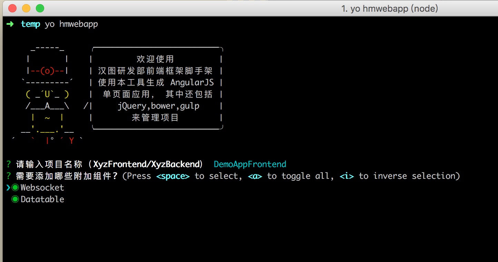

# 汉图 WebApp 生成工具 

> [Yeoman](http://yeoman.io) generator that scaffolds out a front-end web app using [gulp](http://gulpjs.com/) for the build process




## Features

Please see our [gulpfile](app/templates/gulpfile.js) for up to date information on what we support.

* enable [ES2015 features](https://babeljs.io/docs/learn-es2015/) using [Babel](https://babeljs.io)
* CSS Autoprefixing
* Built-in preview server with BrowserSync
* Automagically lint your scripts
* Map compiled CSS to source stylesheets with source maps
* Awesome image optimization
* Automagically wire-up dependencies installed with [Bower](http://bower.io)

*For more information on what this generator can do for you, take a look at the [gulp plugins](app/templates/_package.json) used in our `package.json`.*


## Getting Started

- Install: `npm install --global yo gulp-cli bower generator-hmwebapp`
- Install: `npm install --global yo generator-hmwebapp`
- Install: `npm install --global yo gulp-cli bower git+https://github.com/lulee007/generator-hmwebapp.git#>=1.0.0`
- Run `yo hmwebapp` to scaffold your webapp
- ~~Run `gulp serve` to preview and watch for changes~~
- ~~Run `bower install --save <package>` to install frontend dependencies~~
- ~~Run `gulp serve:test` to run the tests in the browser~~
- ~~Run `gulp` to build your webapp for production~~
- ~~Run `gulp serve:dist` to preview the production build~~


## Docs

* [getting started](docs/README.md) with this generator
* [recipes](docs/recipes/README.md) for integrating other popular technologies like CoffeeScript
* [details](docs/bower.md) about our Bower setup

## Options

- `--skip-welcome-message`
  Skips Yeoman's greeting before displaying options.
- `--skip-install-message`
  Skips the the message displayed after scaffolding has finished and before the dependencies are being installed.
- `--skip-install`
  Skips the automatic execution of `bower` and `npm` after scaffolding has finished.
- `--test-framework=<framework>`
  Either `mocha` or `jasmine`. Defaults to `mocha`.
- `--no-babel`
  Scaffolds without [Babel](http://babeljs.io) support. This only applies to `app/scripts`, you can still write ES2015 in the gulpfile, depending on what your version of Node [supports](https://kangax.github.io/compat-table/es6/).


==============

## Git

打标签：

```sh
git tag -a v1.0.0 -m '第一个版本'
git push origin v1.0.0
```